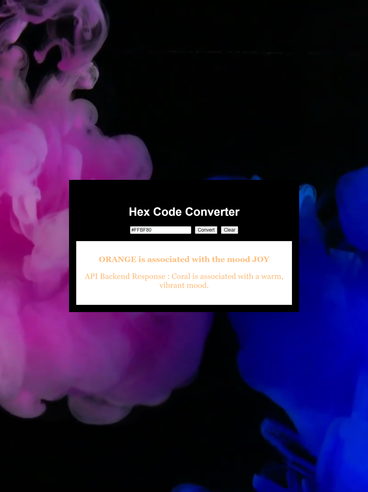

<div align="center">

# ColorCodeConvert

<p align="center">
    
    
    
    
    
    
</p>

</div>

# Overview

"A web application that converts hex codes into English color names using the LLM API Gemini. It also analyzes and identifies the mood associated with each color, enhancing design and marketing decision-making."

The application is built using a robust tech stack, including:

Frontend: Developed with React, ensuring a responsive and dynamic user experience.
Backend: Powered by Node.js and Express, providing a reliable and scalable API for processing hex codes.
AI Integration: Utilizes Google Generative AI for interpreting hex codes and determining color names and associated moods.

## Dependencies:
```
npm install cors dotenv express 
npm install @google/generative-ai

```

## To Run:
Start the UI 
```
npm  start
```
Start the server 
```
node server.js
```

# Usage
```
GIVEN a Hex Color Code Convertor Web Application
WHEN we load the application
THEN we are presented with an input field to enter a hex code , a "Convert" button and a "Clear" button
THEN we are presented with an input field to enter a hex code and a "Convert" button
AND the user can input a hex code and click "Convert"
THEN the application displays the corresponding color name and the associated mood
AND the output text color dynamically changes to match the hex code color provided.

```


# Contributor

Alekhya Erikipati ©2024 All Rights Reserved.


# License

This project is licensed under the terms of the MIT license.
